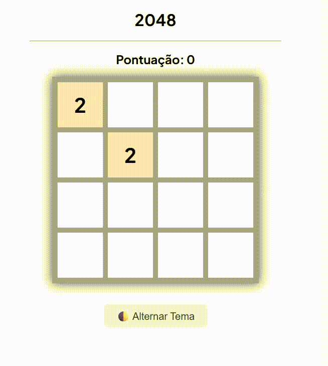

# 🎮 2048 Game

Um clone simples e funcional do famoso jogo 2048.

## 📷 Preview



## 🚀 Funcionalidades

- Tabuleiro 4x4 clássico
- Combinação automática de blocos
- Sistema de pontuação
- Geração dinâmica dos blocos
- Tema claro/escuro
- Design responsivo com efeitos visuais
- Código totalmente comentado para facilitar o aprendizado

## 🛠️ Tecnologias utilizadas

- **HTML5** para marcação semântica.
- **CSS3** com `flexbox`, transições e temas.
- **JavaScript** para eventos e lógica.
- **Google Fonts** — tipografia com a fonte _Plus Jakarta Sans_.

## 🎮 Como Jogar

- Use as teclas do **teclado**:
  - `←` para mover à esquerda
  - `→` para mover à direita
  - `↑` para mover para cima
  - `↓` para mover para baixo
- O objetivo original é combinar os blocos com os mesmos valores até alcançar o **2048**, este foi ampliado para possibilitar alcançar até o **8192**.

## ▶️ Como Usar

Entre no site: [Preview 2048](https://2048-efrals.netlify.app)

OU

1. Clone o repositório:

   ```bash
   git clone https://github.com/seu-usuario/seu-repositorio.git
   ```

2. Navegue até a pasta do projeto

3. Abra o arquivo `index.html` em seu navegador.
